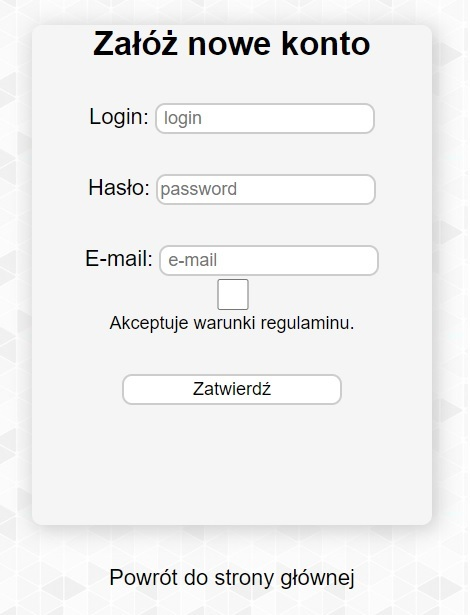
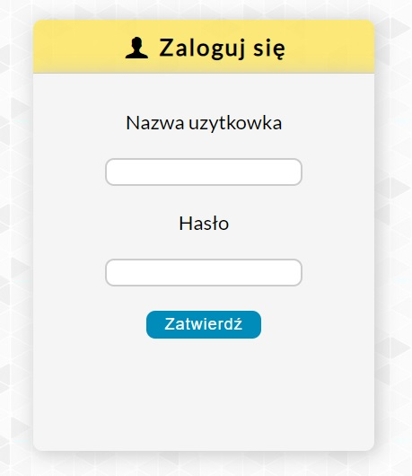
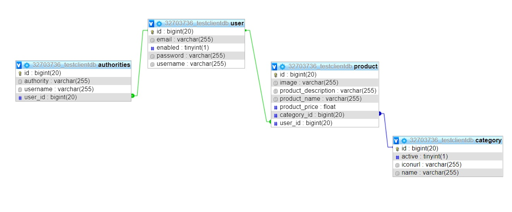

## Table of contents
* [General info](#general-info)
* [Technologies](#technologies)
* [Functionality](#functionality)
* [Database structure](#database-structure)
* [Setup](#setup)
* [To do](#to-do)

## General info

This project is a simple web application that allows the user to manage content of items for sale.
The main purpose of creating this application is to learn the technologies listed below.
I plan to expand with additional functionalities and continuous improvement of code quality.

## Technologies:

Project is created with:

* Java
* Maven
* Spring (Spring Boot, Security)
* Hibernate
* JSP
* H2 embedded database
* HTML
* CSS
* Used IDE - IntelliJ IDEA.

## Functionality

Application includes main page where all items for sale are shown.You can  search item by name.

User can create a profile by short registration form.

After logging in

user can create new advert of items for sale, update and delete exsisting ones. 
While creating new one you can add picture, name, description, category  and price. 

## Database structure

## Setup

## To do

1. Filter items by time of creating new item advert.
2. Filter items by category.
3. Add page with item details and with contact to the owner of that item.
4. Update of front end of application.

